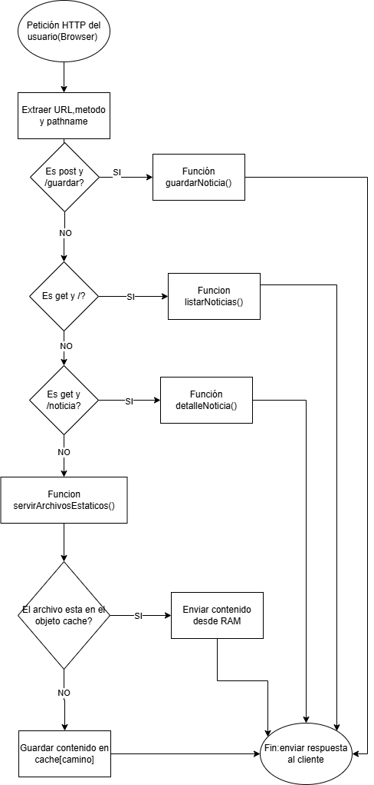

# Actividad Obligatoria N.º 1 - Programación de Aplicaciones Web II
## Unidades 1, 2 y 3: Node.js, HTTP y Persistencia

* **Alumno:** Juan Ignacio Garcia
* **Fecha de entrega:** 20 de abril de 2026
* **Institucion:** Instituto Universitario Aeronáutico (IUA)

---

## 1. Diagrama de Flujo

* [Enlace al diagrama editable]https://drive.google.com/file/d/1ROwu_i7Pa4-gvgjLZgmyIPg70LYE6WgF/view?usp=sharing

## 2. Arquitectura y Selección de Librerías
Para cumplir con la consigna de no utilizar frameworks (como Express), el servidor se basa íntegramente en módulos nativos de Node.js y un paquete externo de NPM para la gestión de tipos de archivos.

### 2.a - Módulos nativos de Node.js

| Módulo | Uso en la aplicación | Funciones clave |
| :--- | :--- | :--- |
| **http** | Crear y lanzar el servidor web. | `createServer()`, `listen()` |
| **fs** | Leer y escribir archivos (noticias y estáticos). | `readFile()`, `appendFile()` |

### 2.b - Paquetes de npm (Obligatorio)

* **Nombre del paquete:** `mime`
* **Comando de instalación:** `npm install mime` 
* **Versión utilizada:** 3.0.0 
* **Justificación:** Se utiliza para resolver dinámicamente el `Content-Type` de los archivos en la carpeta `/public`.Esto permite que el navegador reconozca correctamente el CSS y el HTML, cumpliendo con los requisitos de servir archivos estáticos con su tipo MIME correspondiente.

## 3. Explicación de la Implementación

### Bloque A: Servidor HTTP y routing
Para la creación del servidor utilicé `http.createServer()`, que funciona como el núcleo de la aplicación recibiendo todas las peticiones entrantes. La lógica de ruteo la implementé mediante condicionales `if/else`, ya que me resultó la forma más clara de evaluar dos variables en simultáneo: el método HTTP (`pedido.method`) y la ruta (`url.pathname`). Esto me permite derivar la ejecución hacia funciones específicas para cada caso (como cargar el formulario o listar las noticias) y manejar errores 404 si ninguna condición se cumple.

### Bloque B: Servicio de archivos estáticos con caché
Para optimizar el servidor, implementé un sistema de caché utilizando un objeto literal `cache = {}`. La lógica funciona en dos pasos:
1. **Verificación:** Antes de leer el disco, el servidor consulta si el recurso solicitado (como el CSS o imágenes) ya existe en el objeto `cache`. Si existe, se sirve inmediatamente desde la memoria RAM, lo cual es mucho más rápido.
2. **Lectura y Almacenamiento:** Si no está en caché, utilizo `fs.stat()` para verificar la existencia del archivo (manejando el error 404) y `fs.readFile()` para obtener su contenido. Si la lectura es exitosa, el contenido se guarda en el objeto `cache` para futuras peticiones y se envía al cliente con el código 200. También se maneja el error 500 en caso de fallos inesperados de lectura.

### Bloque C: Captura de datos POST
Para recibir las noticias desde el formulario, utilicé el modelo de eventos de Node.js, ya que es la forma más eficiente de procesar información sin bloquear el servidor:
1. **pedido.on('data')**: Los datos llegan en fragmentos llamados "chunks".Esto permite que el servidor gestione la memoria de forma óptima y siga atendiendo otros pedidos mientras concatena los pedacitos en la variable `cuerpo`.
2. **pedido.on('end')**: Cuando la recepción termina, utilizo `URLSearchParams` para traducir ese texto amontonado.Con el método `.get()`, busco los valores específicos de 'titulo' y 'contenido' para guardarlos en variables inmodificables (`const`).
3. **Persistencia**: Finalmente, utilizo `fs.appendFile()` para agregar la noticia al archivo `noticias.txt` de forma permanente y redirijo al usuario a la página principal.

### Bloque D: Parámetros GET y Detalle de Noticia
Para mostrar una noticia específica, utilicé parámetros de consulta (query strings) en la URL:
1. **Extracción**: Con `url.searchParams.get("id")` logro "atrapar" el número que el usuario escribe en la barra de direcciones. 
2. **Procesamiento**: Al leer el archivo `noticias.txt`, uso `.split("\n")` para separar el texto en una lista de noticias individuales. El `id` capturado me sirve para elegir exactamente la fila que el usuario quiere ver mediante `lineas[id]`.
3. **Manejo de errores**: Si el ID no existe o la noticia no se encuentra, el código está preparado para mostrar un mensaje de "Noticia no encontrada", evitando que el servidor se caiga.

### Bloque E: Persistencia y Generación de HTML Dinámico
Para mostrar la información al usuario de forma prolija, utilicé un sistema de plantillas:
1. **Separación de responsabilidades**: En lugar de escribir el HTML dentro de JavaScript, utilizo un archivo `index.html` independiente. Esto me permite mantener la estética y el diseño del sitio sin afectar la lógica del servidor.
2. **Reemplazo dinámico**: Utilicé un marcador de posición llamado `{{NOTICIAS}}`. Mediante el método `.replace()`, el servidor inyecta el contenido (ya sea el listado total o el detalle de una noticia) justo en ese lugar antes de enviar la respuesta al navegador.
3. **Persistencia**: La información se lee directamente de `noticias.txt`, lo que garantiza que, aunque el servidor se reinicie, las noticias guardadas permanezcan disponibles para los usuarios.

---
## Enlaces del Proyecto
* **Repositorio GitHub:** [https://github.com/tu-usuario/nombre-del-repo](https://github.com/tu-usuario/nombre-del-repo)
* **Diagrama de Flujo Editable:** [Link de Canva/Lucidchart/etc]